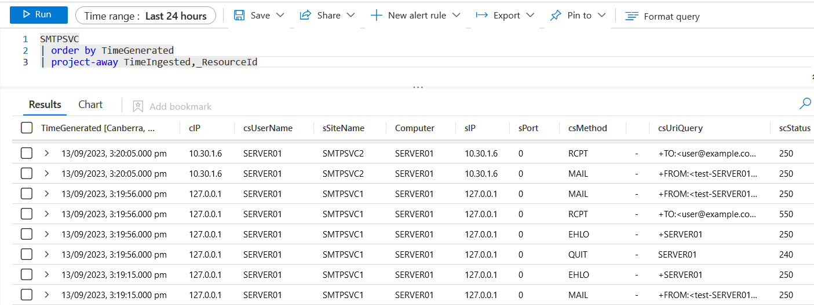
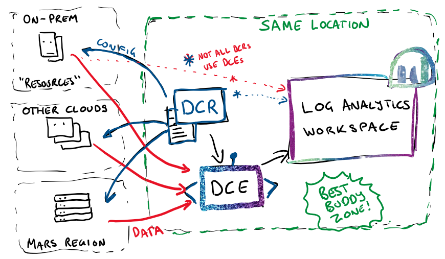

Microsoft Sentinel IIS SMTP noodles
===================================
Noodling about with SMTP logging and Azure Monitor Logs / Microsoft Sentinel.

**Note:** This project is **not** a Microsoft product and support is not formally provided!

## Tools provided

This folder contains:
- A **Data Collection Rule** (DCR) to pull IIS SMTP logs from C:\Windows\System32\Logfiles\SMTPSVC[1-9]\e*.log
  - DCR directs logs to a custom table called `SMTPSVC_CL`, without any source transformation
- A basic **parser function for Log Analytics (SMTPSVC)** which splits and parses SMTPSVC_CL into named columns

This should be enough to get about as much as the IIS SMTP service is prepared to offer you, which can then be used for correlation and enrichment with more useful and interesting tables in Sentinel (IdentityInfo, ThreatIntelligenceIndicators, any other mail tables you're ingesting...)



## IIS SMTP Log Data Collection Rule

**Note**: **A Data Collection Endpoint (DCE) is needed for custom text log ingestion, so if you don't have one already, set one up first**, in the same region as your Log Analytics Workspace. This is the same region you'll need to deploy the DCR to: While the resources being collected *from* can be anywhere, the DCE must be in the same location as the Log Analytics Workspace and the Data Collection Rule. 



[](https://portal.azure.com/#create/Microsoft.Template/uri/https%3A%2F%2Fraw.githubusercontent.com%2FTristankMS%2Fsentinel-noodling%2Fmain%2FIIS-SMTP%2FSMTP-DCR-Template.json)

### Post-deployment

Once the rule is deployed, you can assign Resources to it, and logs should start to be picked up within 5-10 minutes.

### Testing and basic troubleshooting

Starting point:
`SMTPSVC_CL | order by TimeGenerated`

If you're not getting data:

- Eyeball the rule properties in the Portal UI and check for workspace typos and reference issues
- If logs aren't being ingested, use standard Azure Monitor Agent troubleshooting...
- Experience has shown that custom text log collection is an "as writes complete" proposition, so you may need to generate some load in order to test the logging.
  Using PowerShell locally:
  - `Send-MailMessage -SmtpServer localhost -From "test-$($env:Computername)@example.com" -To "user@example.com" -Subject "Test from $($env:Computername) $(++$i)"  -Body "Just checking" # NB probably helps for the "To" address to work or be homed on the server if it's not a relay...`

## SMTPSVC Parser Function for SMTPSVC_CL

Can be deployed to any workspace at any time. (Of course won't *work* until the SMTPSVC_CL table is present...)

Click the button below and point at your Log Analytics workspace to deploy the SMTPSVC function.

[](https://portal.azure.com/#create/Microsoft.Template/uri/https%3A%2F%2Fraw.githubusercontent.com%2FTristankMS%2Fsentinel-noodling%2Fmain%2FIIS-SMTP%2FSMTP-Parser.json)

Once deployed, you should see the function under Logs in *Functions*.

# Setting up Logging with IIS SMTP on Windows Servers

IIS SMTP uses *IIS 6 compatibility mode* on IIS 7 and later, so:

- it runs in INETINFO.EXE (which is not required for 7+)
- it uses the Metabase emulator (and metabase.xml) for configuration storage
- it logs to `C:\Windows\System32\Logfiles\SMTPSVC1` by default.

The default logging configuration is kindas watery at best, so needs to be *maxed out*!

Once maxed out, you still *don't* get *amazing* levels of detail, but it's enough to start...

When the SMTP service is installed, it drags in IIS 6 compatibility mode, and the InetMgr.msc console, but not the ADSUTIL.vbs or related admin scripts by default. You need to add those manually or work around their non-presence.

## Setting IIS SMTP "sites" to log

On the IIS SMTP Server, you've got a few options, ranging from easy to fiddly:

### WMI

Using WMI *probably* works without IIS 6 Management *Scripts* installed (just Management Compatibility), and makes it easy to configure all logging settings in one whack:

#### WMI via PowerShell

If available, directly copy/paste-able (or save to `Set-smtp-logs.ps1` and run from there...)

```PowerShell
$smtpServices = Get-WmiObject -Namespace "root\MicrosoftIISv2" -Class "IIsSmtpServerSetting"

foreach ($service in $smtpServices) {
    "SMTP Service   : $($service.Name)"
    "LogExtFileFlags: $($service.LogExtFileFlags)"
    $service.LogExtFileFlags = 4194303
    $quietplease = $service.Put()
}
```

#### WMI via VBScript

Save as `set-smtp-logs.vbs` and run with `CSCRIPT set-smtp-logs.vbs`

```VBScript
strComputer = "."
Set objWMIService = GetObject("winmgmts:{authenticationLevel=pktPrivacy}\\" & strComputer & "\root\MicrosoftIISv2")

Set colSMTPServices = objWMIService.ExecQuery("SELECT * FROM IIsSmtpServerSetting")

For Each objSMTPService in colSMTPServices
    Wscript.echo objSMTPService.Name
    Wscript.echo "Original LogExtFileFlags value: " & objSMTPService.LogExtFileFlags
    objSMTPService.LogExtFileFlags = 4194303 ' all options ticked
    objSMTPService.Put_
    Wscript.echo "Updated."
Next
```

### Using ADSUtil.vbs
If WMI isn't being friendly: the ADSUTIL.VBS admin scripts are not installed by default, but can be installed from Server Manager (IIS 6 Management Scripts).

If installed, you can check current logging flags with:

`cscript C:\inetpub\AdminScripts\adsutil.vbs get /smtpsvc/1/LogExtFileFlags`

And set all available flags with 

`cscript C:\inetpub\AdminScripts\adsutil.vbs Set /smtpsvc/1/LogExtFileFlags 4194303`

### Or or or

- Or by editing `C:\Windows\System32\Inetsrv\metabase.xml` directly.
- Or by editing each SMTP Virtual Server's Logging properties in the legacy **IIS 6.0 Manager** through the GUI.


## Future ideas
- Some fields look useless and might be tuned out at the source, but "enable all log tickboxes" is very simple guidance
- Source transformation to some extent
- Integrating deployment packages


